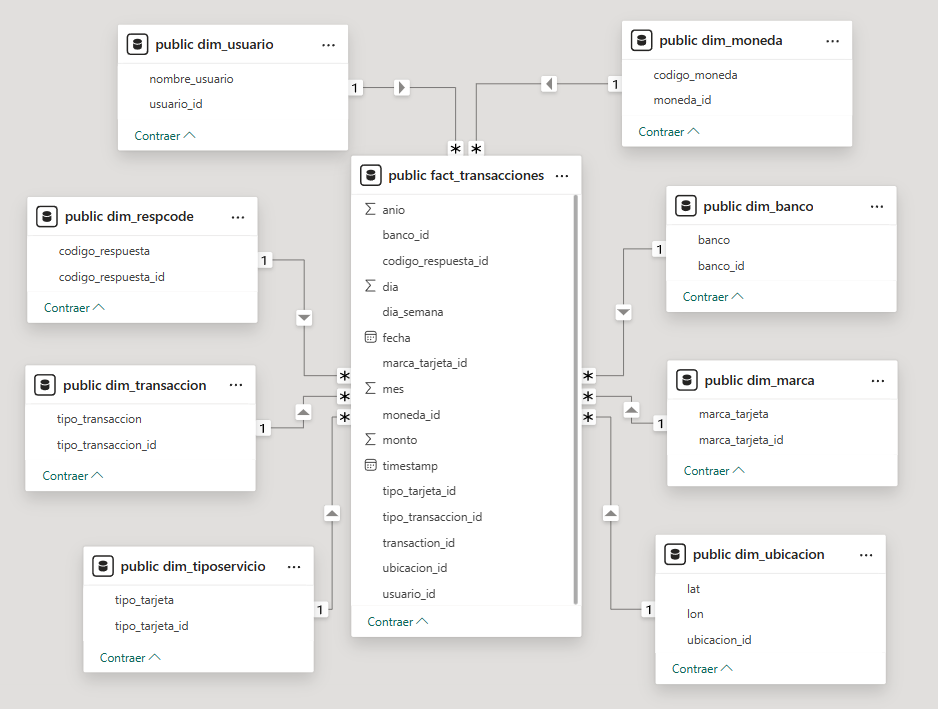

# ISO8583ETL

**ISO8583ETL** es un pipeline de procesamiento en tiempo real diseñado para procesar transacciones ISO8583. El proyecto simula generación de datos ISO8583 usando Python y utiliza Apache Spark para ingerir, transformar y cargar estos datos en una base de datos PostgreSQL.

---

## 🚀 Características

✅ Simulación de mensajes ISO8583 (campos típicos como MTI, PAN, monto, etc.)  
✅ Procesamiento en tiempo real con Apache Spark Structured Streaming  
✅ Persistencia de datos transformados en PostgreSQL  
✅ Arquitectura modular y escalable  
✅ Preparado para integrarse con mensajería (Kafka, RabbitMQ, etc.) en futuras versiones

---

## 🛠 Tecnologías Usadas

- **Python 3.x**
- **Apache Spark 3.x (Structured Streaming)**
- **PostgreSQL**
- **Docker / Docker Compose**
- (Opcional) Kafka / RabbitMQ para futuras integraciones

---

## 📂 Estructura del Repositorio
```
ISO8583ETL
├── generator
│ └── data
│ └── generateData.py
├── spark/
│ └── app
│     └── etl_spark.py
│ └── jars
│     └── postgresql-42.7.1.py
├── docker-compose.yml
├── Dokerfile-python
├── Dokerfile-spark
└── README.md
```


---

## ⚙️ Arquitectura


```
┌───────────┐   ┌───────────┐    ┌─────────────┐    ┌──────────┐  
│ Producer  │→→ │ Apache    │ →→ │ PostgreSQL  │ →→ │ PowerBI  │
│ (Python)  │   │ Spark     │    │             │    │          │   
└───────────┘   └───────────┘    └─────────────┘    └──────────┘
```

---
## 🚀 Power BI

Modelo Estrella - Power BI

